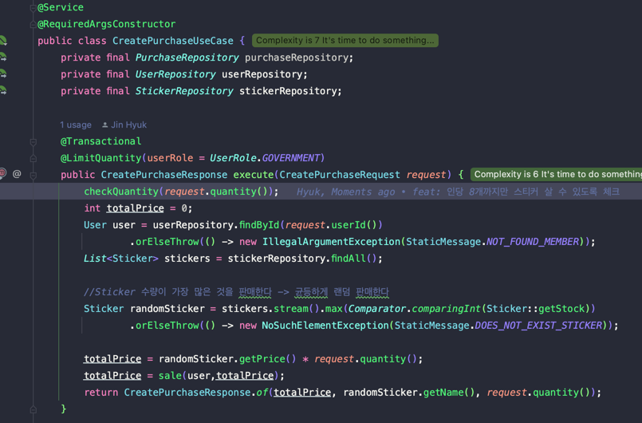
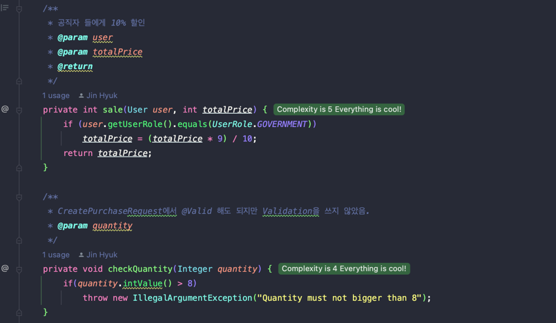

# Spring Study

서현 이메일 : **[ymecca730135@gmail.com](mailto:ymecca730135@gmail.com)**

# 1주차

1. 남원인쇄소에 발주 1000개씩 넣음
2. 추가 재고 요청은 100개단위로
3. 100개당 10,000원 
4. 1000개당 25,000원 할인 → 75,000원 
5. 예산을 100만원으로 산정
6. 발주 목록
    - 남원 두마리 양념치킨
    - 남원 창립
    - 남원시 인구
    - 남원시 정당
    - 남ㅇ원 양림
    - 남원 지리산

## 1번 문제 요구사항

1. 스티커 1개당 1명에게만 팔 수 있고 1인당 8개만 살 수 있다.
2. 공직자 에게는 10% 할인
3. 공직자에게 제공할 수 있는 판매 수 는 전체 30%
4. 고객은 스티커를 지정할 수 없고 각 스티커가 균일하게 랜덤으로 판매

**스티커**를 **판매**한다.

공직자(사용자의 Role)는 10% **할인**, **판매**수는 전체 30%

남원인쇄소에 **발주** 

- 남원 인쇄소를 도메인으로 봐야할까?

---

`발주를 넣다` 라는 뜻은 정해진 스티커를 가져오는 것이 아니라 사용자가 원하는 스티커 이름, 모양, 수량 등을 인쇄소에 스타커를 만들어서 주라는 뜻

그렇다면 UserFlow는 어떻게 되야할까?

내가 생각하기엔 이렇다.

# 사용자 → 발주(publish) → 스티커 생산

남원시청이 남원인쇄소에 발주를 넣고 남원 인쇄소는 돈이 입금이 되었는지 확인하고 스티커 생산에 들어간다.
- 여기서는 발주를 넣자마자 입금을 하여 바로 남원시청에게 스티커를 배송했다고 가정했다.

### User

공직자에게는 할인과 판매 할 수 있는 최대 수량이 제약적임으로 UserRole을 Enum으로 관리하였다.

## Publish

누가(User), 무엇을(stickerName), 얼마나(quantity) 발주를 넣었는지 알 수 있도록 하고,

입금 금액과 발주 넣은 것의 금액과 비교해서 일치하면 스티커 제작을 해야함으로 price도 넣었다.
- price는 남원시청이 남원인쇄소에 보내야 하는 금액이다. 

## Sticker

이 스티커는 남원 시청에서 가지고 있는 Sticker이다.

즉, 남원시청이 남원 인쇄소에 발주를 넣고 배송받아 가지고있는 Sticker의 수량이다.

나중에 스티커를 판매할 때 이 Sticker 테이블에서 재고를 감소하면되고 재고 현황 또한 여기서 확인할 수 있다.

# 1번 문제

## 발주 넣기

### Controller

발주가 곧 스티커를 만들어내는 행위이기 때문에 /api/sticker (POST)로 end point url을 설정했지만 sticker를 상품으로 보고 /api/publish/sticker 라고 설정해도 될 것 같다.

- 만약 나중에 확장하여 sticker이외의 다른 물품도 인쇄소에서 제작을 하고 sticker를 발주 넣는 형식과 동일하다면 sticker 대신 product라고 사용해도 될 것 같다.

### RequestDto

여러개의 스티커를 한번에 발주 넣을 수 있음으로 발주에 해당하는 것을 `PublishDto`

그리고 발주 총 비용을 나타내는 totalPrice… (하지만 생각해보니 PublishDto의 price를 더한 값이 totalPrice이기 때문에 딱히 없어도 될 것 같다)

- PublishDto를 record로 한게 아니라 클래스로 작성한 이유는 각 스티커 1000개 발주 시 금액의 25%를 할인 해주기 때문에 class로 작성하였습니다.
    - record는 필드가 private final 이기 때문에 price를 수정할 수 없음

## UseCase(Service)

UserCase를 인터페이스로 하고 그것을 구현한 Service가 있어야 하지만 구현체가 1개라고 가정하고 UseCase를 Serive로 작성하였다.

- 생각해보니 PublishStickerUseCase에 @Component가 아니라 @Service가 붙어야 할 것 같다.

여러개의 발주를 stream으로 작업한 것이다.

추가 발주는 100개 단위로 할 수 있다고 했으니 발주는 100개씩 넣어야 한다고 해석했다.

먼저 각 발주 넣은 스티커(상품)에 발주량이 1000개인지 확인하고 1000개라면 25%할인 해준다.`(publishDto.sale)`

그리고 할인이 적용된 가격과 sickerName과 누가 발주했는지를 나타내는 Publish Entity를만들고 save한다.

발주 넣고 배송이 완료되면 어떤 스티커가 몇개 있는지를 나타내는 Sticker Entity를 만들고 save 해야하지만 일단 남원 시청이 인쇄소에 발주를 넣으면 바로 그만큼의 스티커를 소유하고 있다고 가정하였다.

마지막으로 사용자에게 어떤 스티커를 발주 했는지 보여주기 위해 스티커의 이름만 응답으로 보내주었다

## 스티커 재고 조회

이것은 간단하니 설명을 생략하도록 하겠다.

## 스티커 구매/판매
### Usecase

**`스티커 1개는 1명에게만 팔 수 있고 인당 8개로 판매수를 제한합니다.`** 라는 조건을 인당 1개의(종류) 스티커를 구매할 수 있는데 최대 8개를 구매할 수 있다고 해석했다.

그리고 고객이 스티커를 구매할 떄는 어떤 스티커를 살지 고를 수 있는 것이 아니라(랜덤으로 정해짐) 수량만 정할 수 있다.

균등하게 랜덤으로 스티커를 판매하기 위해 스티커의 남은 재고중 가장 가장 큰 거부터 판매하도록 구현하였다.

### AOP
`단, 공직자에게 제공할 수 있는 모든 판매 갯는 전체의 30%로 제한합니다.` 라는 조건이 처음에는 별거아니다 라고 생각했지만 동시성 문제가 생긴다고 판단이 되었다.

구매가 이루어지는 과정은 다음과 같다. (공직자의 경우)
1. 구매 요청이 들어온다
2. 공직자에게 판매한 스티커량이 스티커 초기 재고의 30%가 넘는지 확인한다. (데이터 읽기)
3. 만약 넘지 않는다면 구매 요청으로 들어온 수량만큼 스티코 재고에서 감소시킨다. (데이터 쓰기)
4. 사용자에게 구매완료 정보를 전달한다.

위의 과정을 인지하고 예를들어 공직자 A와 B가 있다고 가정하고 A와 B가 스티커를 구매하려고 한다. 그리고 A가 구매가 된다면 B는 구매가 되면 안된다(30% 넘어벼러서)

A가 구매요청을 먼저 보냈다 -> A 데이터 읽기 작업(30% 확인) -> B가 구매요청 보냄-> B 데이터 읽기(30% 확인 ->) A 데이터 쓰기(재고 감소) -> B 데이터 쓰기(재고 감소) ....

이런식으로 동시성 문제가 생겨날 수 있다. (실제 update 쿼리는 쓰기 지연 저장소에 저장되어있다가 CreatePurchaseUseCase의 execute 메서드의 트랜잭션이 commit 될 때 날라감으로)

그렇다면 이러한 문제를 어떻게 해결 할 수 있을까??

제가 생각한 방법은 CreatePurchaseUseCase의 execute 메서드 실행 전, 후로 30%를 확인하면 되지 않을까? 였고 이를 위해 AOP @Around를 사용했습니다.

---

# 5번문제

## 본인이 위 스터디를 참여하게 된 계기와 함께 스터디를 통해 만들고 싶은 가치는 무엇인가?

- 계기 : 저번에 에코노베이션에 외주가 한번 들어왔었는데 요구사항이 마치 비전공자가 작성한 듯한 요구사항이었습니다. 처음에 그 요구사항을 볼 때 어떻게 구현을 하면 좋을지 잘 떠오르지 않았습니다. 
지금까지 한 프로젝트를 되돌아 보니 요구사항이 복잡하지 않았거나 처음부터 기획을 하며 기능을 뽑아냈기 때문에 구현 하는데 어려움이 없었던 것 같습니다. 
**이에 요구사항이 Raw 하거나 복잡한 요구사항을 잘 해석하는(고객의 요구사항 의도를 파악하는 것 == 출제자의 의도를 파악하는것) 능력을 기르고 그에 맞게 구현하는 능력을 기르고 싶어 스터디에 참여하게 되었습니다.**
- 가치 : 저의 능력 상승 뿐만 아니라 같은 요구사항에 다른 사람들은 어떻게 생각하였는지 어떻게 구현하였는지를 보고 피드백하면서 넓은 인사이트를 얻을 수 있을 것 같습니다.
